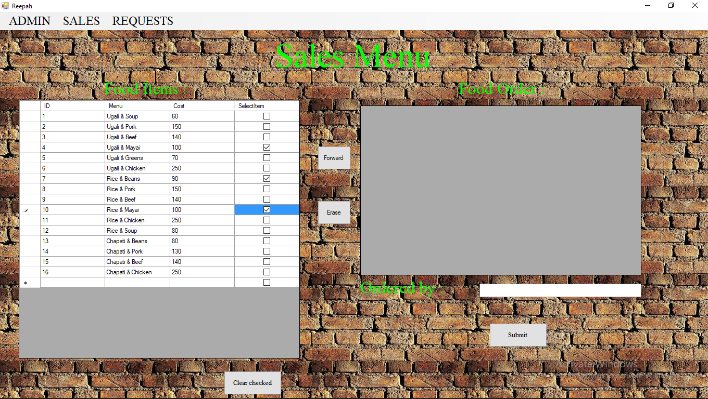
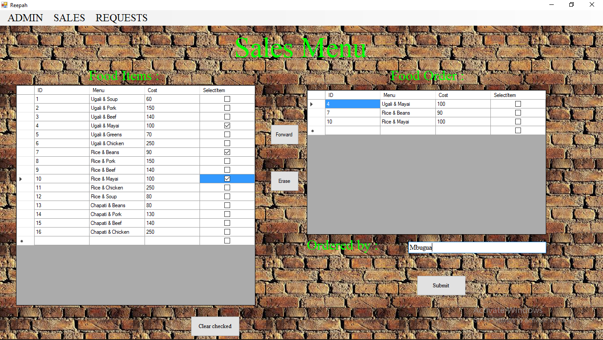

# Sironi_tech
a resturant application for taking orders and posting at the chef's end.

<b>The MDI (<em>Multiple Document Interface</em>)

<b>Selecting meals by checking/tick the given menu.

<b>Forward the selected meals to the next table to confirm your meals.

<b>Confirming if the selected menu is that which you want to order.

<b>Making your order and providing your credentials.

<b>Admin can lock the ui to constrain user input. In this case, the forward, erase and order buttons will be disabled
along side the check box to restrict users. For example,if a meal is not ready the admin can constrain it from being selected.

<b>Implementation of the constrained interfaces.

